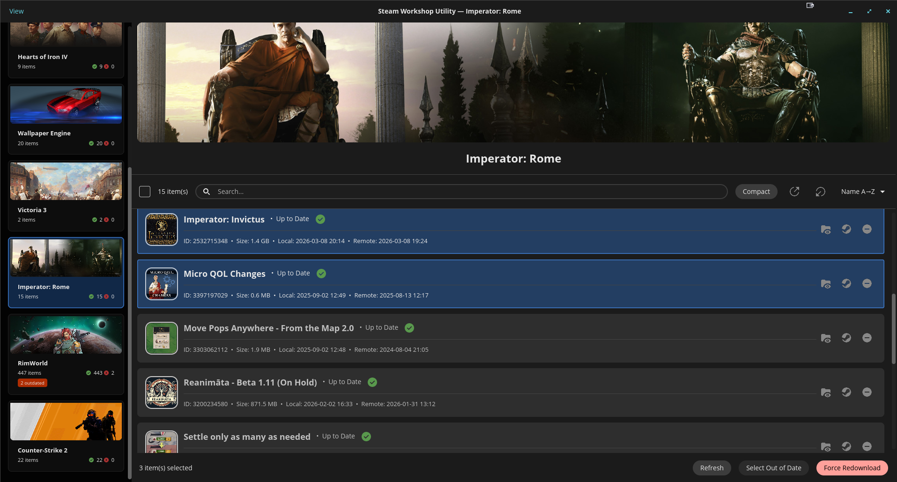
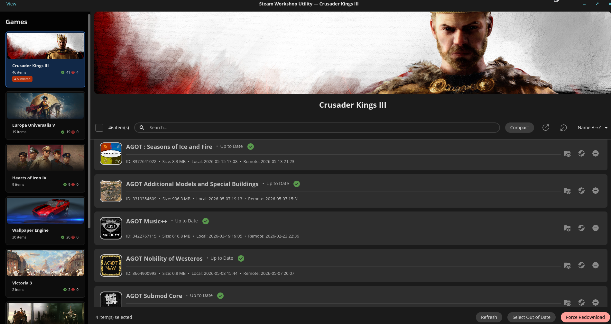

A native Linux (& Windows compatible) desktop application for managing Steam Workshop items — browse your subscribed mods, identify out-of-date content, and force a clean redownload directly from Steam.

---

## Features

- **Library scan** — automatically discovers all Steam games with workshop content on your machine
- **Status detection** — compares local and remote timestamps to flag items as Up to Date, Out of Date, or Unknown
- **Force redownload** — deletes local workshop files, zeros the ACF manifest entries, and re-queues downloads via Steam URIs
- **Download polling** — watches for Steam to complete downloads and reports progress in real time.
- **Game card sidebar** — scrollable list of your games with banner art, item counts, and an outdated badge at a glance
- **Search & sort** — filter workshop items by name or ID; sort by name, size, or status
- **Compact mode** — toggle between a detailed view (with thumbnails, timestamps, file size) and a dense compact list
- **Thumbnails** — fetches workshop item preview images from the Steam CDN and caches them for the session
- **Game banners** — loads Steam library hero or header art for each game

---

## Screenshots

---

## How It Works

### Scanning

On launch the app scans your Steam library directories for `steamapps/workshop/content/<_appid>/` folders. For each game found it reads the local ACF manifest (`appworkshop_<_appid>.acf`) to get item timestamps, then calls the Steam Web API to fetch remote timestamps and item metadata (names, preview images).

### Status Detection

An item is **Out of Date** when its remote timestamp is newer than the local one. **Unknown** means the remote timestamp could not be fetched (e.g. API rate limit or the item was removed from the Workshop).

### Force Redownload

1. Deletes the local directory for each selected item
2. Zeroes out the corresponding entries in the ACF manifest so Steam doesn't think the item is already present
3. Opens `steam://workshop_download_item/<_appid>/<itemid>` for each item
4. Opens `steam://validate/<_appid>` to prompt Steam to verify and queue downloads
5. Polls the local filesystem every second, comparing timestamps until all items are resolved or 5 minutes elapse